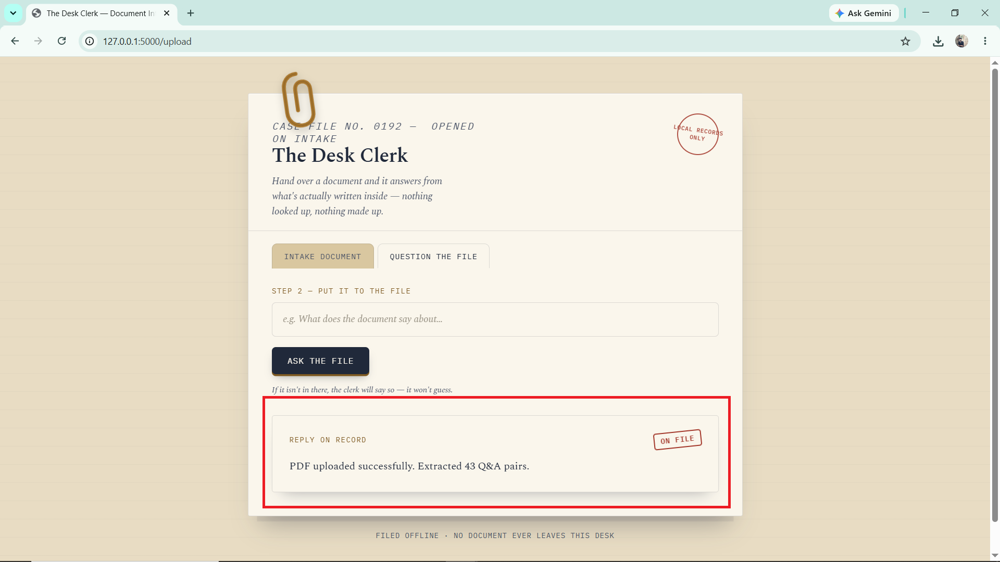
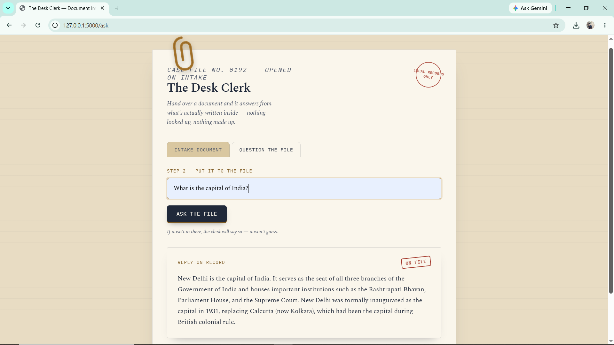
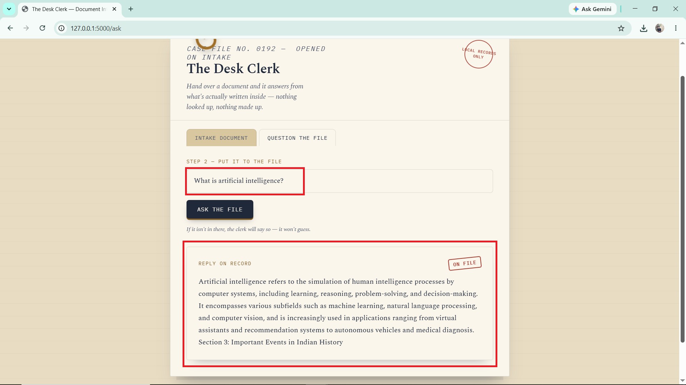

# 🚀 RAG PDF Chatbot

An intelligent **Offline Retrieval-Augmented Generation (RAG) PDF Chatbot** built using **Python, Flask, Sentence Transformers, and FAISS**.

This application allows users to upload PDF documents and ask natural language questions. The system extracts text, builds a semantic vector database, and retrieves the most relevant answers without relying on any external APIs or internet connectivity.

---

# 📌 Features

✅ Upload PDF documents

✅ Extract text automatically

✅ Parse structured Q&A content

✅ Semantic Search using AI Embeddings

✅ Fast Vector Search using FAISS

✅ Offline Question Answering

✅ No OpenAI API Required

✅ No Internet Required

✅ Lightweight and Fast

---

# 🏗️ System Architecture

```text
User Question
      │
      ▼
Sentence Transformer
(all-MiniLM-L6-v2)
      │
      ▼
Question Embedding
      │
      ▼
FAISS Vector Search
(Cosine Similarity)
      │
      ▼
Best Matching Question
      │
      ▼
Answer Retrieval
      │
      ▼
Display Answer
```

---

# 🧠 Algorithms & Methods Used

The project combines multiple Artificial Intelligence and Information Retrieval techniques:

### 1. Retrieval-Augmented Generation (RAG)

Retrieves the most relevant information from uploaded PDF documents before generating the final response.

### 2. Sentence Embeddings

Model Used:

```text
all-MiniLM-L6-v2
```

Converts text into high-dimensional vector representations while preserving semantic meaning.

### 3. Vector Similarity Search

Uses:

```text
FAISS (Facebook AI Similarity Search)
```

for extremely fast nearest-neighbor search over embeddings.

### 4. Cosine Similarity

Embeddings are normalized and compared using cosine similarity.

```text
Similarity Score:
1.0  → Highly Relevant
0.0  → Unrelated
```

### 5. Natural Language Processing (NLP)

Techniques used:

* Text Extraction
* Q&A Parsing
* Semantic Matching
* Keyword Validation

### 6. Information Retrieval

Returns the most relevant answer from indexed PDF content.

---

# 🛠️ Technology Stack

| Technology            | Purpose              |
| --------------------- | -------------------- |
| Python                | Backend Development  |
| Flask                 | Web Framework        |
| FAISS                 | Vector Database      |
| Sentence Transformers | Embedding Generation |
| PyPDF                 | PDF Text Extraction  |
| NumPy                 | Vector Operations    |
| HTML/CSS              | User Interface       |

---

# 📂 Project Structure

```text
Offline-RAG-PDF-Chatbot
│
├── app.py
├── requirements.txt
│
├── templates
│   └── index.html
│
├── uploads
│   └── uploaded_pdfs
│
└── README.md
```

---

# 📸 Application Screenshots

## 1️⃣ Home Screen

Add screenshot here:

```text
screenshots/01.png
```


---

## 2️⃣ PDF Upload Success

Add screenshot here:

```text
screenshots/02.png
```



---

## 3️⃣ Ask Question

Add screenshot here:

```text
screenshots/03.png
```



---

## 4️⃣ Retrieved Answer

Add screenshot here:

```text
screenshots/04.png
```



---

# 🔄 Workflow

### Step 1

Upload PDF document.

### Step 2

Text is extracted using:

```python
PdfReader()
```

### Step 3

Questions and answers are parsed.

### Step 4

Questions are converted into vector embeddings.

### Step 5

FAISS builds a vector index.

### Step 6

User enters a question.

### Step 7

Question embedding is generated.

### Step 8

Cosine similarity search is performed.

### Step 9

Best matching answer is returned.

---

# 📊 Example

### User Question

```text
What is the capital of India?
```

### Retrieved Answer

```text
New Delhi is the capital of India. It serves as the seat of all three branches of the Government of India and houses important institutions such as the Rashtrapati Bhavan, Parliament House, and the Supreme Court. New Delhi was formally inaugurated as the capital in 1931, replacing Calcutta (now Kolkata), which had been the capital during British colonial rule.
```

---

# 💡 Advantages

✔ Fully Offline

✔ No API Cost

✔ Fast Retrieval

✔ Scalable

✔ Privacy Friendly

✔ Easy Deployment

✔ Suitable for Internal Knowledge Bases

✔ Works on Local Machines

---

# 🚀 Future Enhancements

* Multi-PDF Support
* Chat History
* Hybrid Search
* OCR Support
* Local LLM Integration
* Ollama Integration
* Llama 3 Support
* Mistral Support
* PDF Summarization
* Voice-Based Search

---

# 👨‍💻 Author

Karunanidhi N S

---
